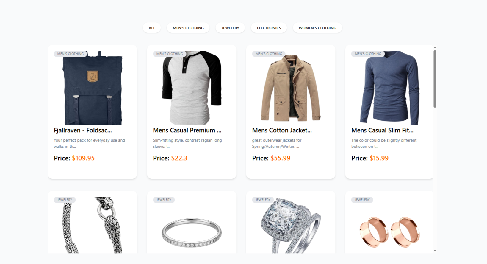
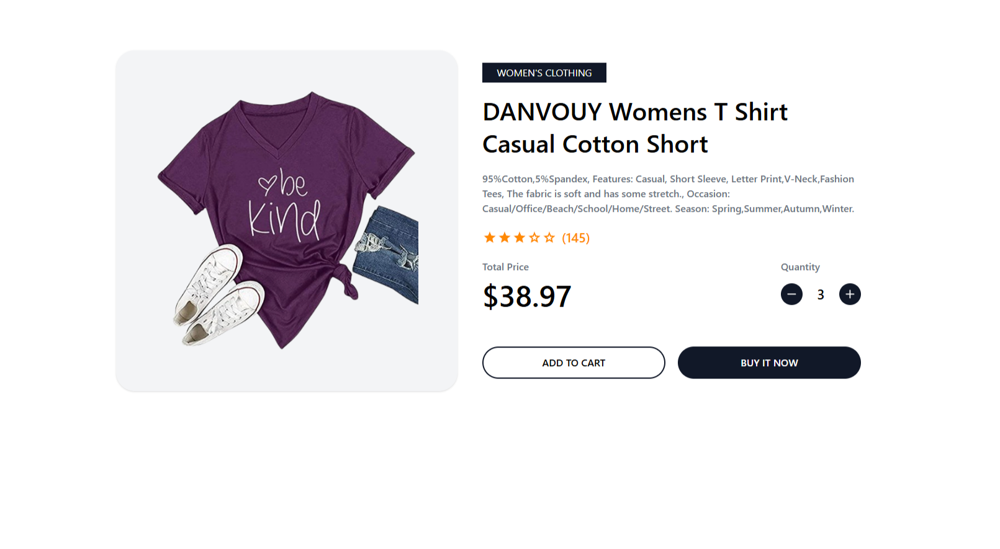

# Product Filtering Page

### A product filtering and detail page built with React.js to demonstrate context API usage, data fetching, and routing concepts.

## 🎯 Overview

This project showcases a functional product filtering system that allows users to browse products by category and view detailed information about individual items. Built as a learning exercise to reinforce React fundamentals including Context API, hooks, and React Router.

 

## ✨ Features

-   **Global State Management:** Implements React Context API to provide product data globally across all components.

-   **Efficient Data Fetching:** Uses `useEffect` hook to fetch product data once after initial render, optimizing performance.

-   **Category Filtering:** Interactive top navigation bar enables filtering products by their categories.

-   **Dynamic Routing:** Integrates React Router DOM for seamless navigation to individual product detail pages.

-   **Product Detail View:** Dedicated page for each product showing complete information including:

    -   Full product description
    -   Pricing details
    -   Quantity selector
    -   Product images

## 🛠️ Technologies Used

-   React.js
-   React Context API
-   React Router DOM
-   Fake Store API

## 📡 API

This project uses the [Fake Store API](https://fakestoreapi.com) for product data:

```javascript
https://fakestoreapi.com/products
```

## API Response per product ID

```javascript
{
      "id": 1,
      "title": "Fjallraven - Foldsack No. 1 Backpack, Fits 15 Laptops",
      "price": 109.95,
      "description": "Your perfect pack for everyday use and walks in the forest. Stash your laptop (up to 15 inches) in the padded sleeve, your everyday",
      "category": "men's clothing",
      "image": "https://fakestoreapi.com/img/81fPKd-2AYL._AC_SL1500_t.png",
      "rating": {
            "rate": 3.9,
            "count": 120
      }
}
```

## 🎓 Learning Objectives

This project was created to practice and solidify understanding of:

-   Context API for state management
-   React hooks (useEffect, useState, useContext)
-   Data fetching and side effects
-   Client-side routing with React Router
-   Component composition and props handling
-   Filtering and data manipulation

## 📝 Note

This is a practice project focused on implementing core React concepts rather than a complete e-commerce solution.
